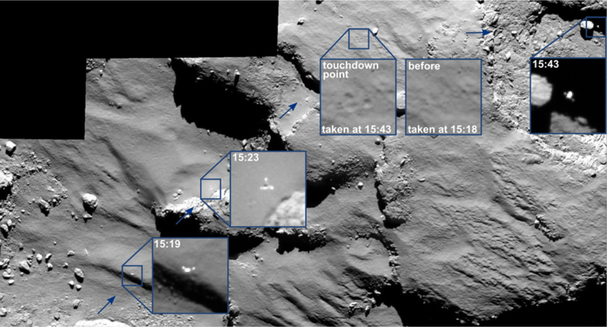
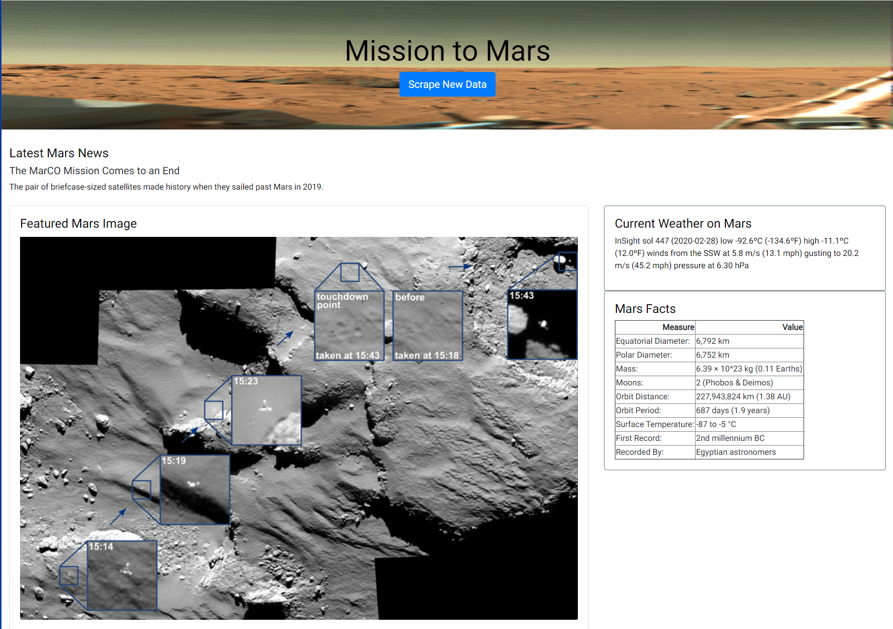
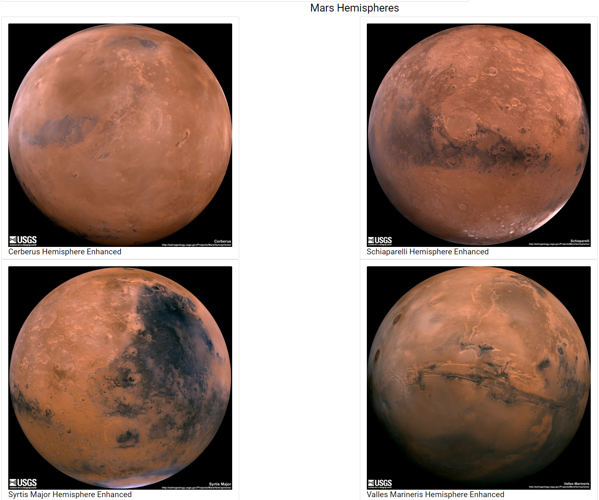

# Web Scraping - Mission to Mars data

Built a web application that scrapes various websites for data related to the Mission to Mars and displays the information in a single HTML page. The following outlines what was done to accomplish this.

### Technologies

1. **Python**
	* Beautiful Soup
	* Pandas
	* Requests.Splinter
	* Flask
2. **HTML**
3. **Javascript**
4. **CSS**
5. **MongoDB**

## Scraping Steps

* Created a Jupyter Notebook file called `mission_to_mars.ipynb` and used this to complete all of the scraping and analysis tasks.

### NASA Mars News

* Scraped the [NASA Mars News Site](https://mars.nasa.gov/news/) and collect the latest News Title and Paragraph Text. Assigned the text to variables that you can reference later.

### JPL Mars Space Images - Featured Image

* Visited the url for JPL Featured Space Image [here](https://www.jpl.nasa.gov/spaceimages/?search=&category=Mars).

* Used splinter to navigate the site and find the image url for the current Featured Mars Image and assign the url string to a variable called `featured_image_url`.

* Found the image url to the full size `.jpg` image.

* Saved the complete url string for this image.

### Mars Weather

* Visited the Mars Weather twitter account [here](https://twitter.com/marswxreport?lang=en) and scraped the latest Mars weather tweet from the page. Saved the tweet text for the weather report as a variable called `mars_weather`.

### Mars Facts

* Visited the Mars Facts webpage [here](https://space-facts.com/mars/) and used Pandas to scrape the table containing facts about the planet including Diameter, Mass, etc.

* Used Pandas to convert the data to a HTML table string.

### Mars Hemispheres

* Visited the USGS Astrogeology site [here](https://astrogeology.usgs.gov/search/results?q=hemisphere+enhanced&k1=target&v1=Mars) to obtain high resolution images for each of Mar's hemispheres.

* Programmatically clicked each of the links to the hemispheres in order to find the image url to the full resolution image.

* Saved both the image url string for the full resolution hemisphere image, and the Hemisphere title containing the hemisphere name. Used a Python dictionary to store the data using the keys `img_url` and `title`.

* Appended the dictionary with the image url string and the hemisphere title to a list. This list contains one dictionary for each hemisphere.

- - -

## MongoDB and Flask Application

Used MongoDB with Flask templating to create a new HTML page that displays all of the information that was scraped from the URLs above.

* Started by converting the Jupyter notebook into a Python script called `scrape_mars.py` with a function called `scrape` that executes all the scraping code from above and returns one Python dictionary containing all of the scraped data.

* Created a route called `/scrape` that imports the `scrape_mars.py` script and calls the `scrape` function.

  * Stores the return value in Mongo as a Python dictionary.

* Created a root route `/` that queries a Mongo database and passes the mars data into an HTML template to display the data.

* Created a template HTML file called `index.html` that takes the mars data dictionary and displays all of the data in the appropriate HTML elements. 

- - -

